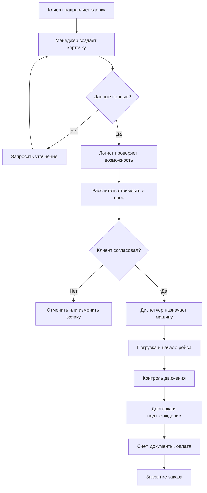

# Сценарии обработки заказа

## Основной сценарий

## Сценарий изменения условий

Если клиент меняет адрес, временное окно, вес, объём или состав груза после согласования, менеджер не редактирует старую версию незаметно. Он создаёт новую версию заказа, передаёт её логисту на расчёт и получает повторное подтверждение клиента. Диспетчер видит только последнюю согласованную версию.

## Сценарий отсутствия транспорта

1. Диспетчер фиксирует, что собственный автопарк не покрывает заказ.
2. Логист подбирает внешнего перевозчика из утверждённого списка.
3. Проверяются договор, страховка, тип кузова, рейтинг и возможность предоставить документы.
4. Клиенту подтверждается, меняется ли стоимость или срок.
5. В карточке заказа отмечается внешний перевозчик и ответственное лицо.

## Сценарий частичной доставки

При частичной доставке водитель фиксирует фактически принятые места и причину расхождения. Диспетчер создаёт дочерний рейс для остатка, если клиент согласовал дальнейшие действия. Основной заказ не закрывается до решения по всем местам или оформления претензии.

## Сценарий отмены

Отмена до назначения транспорта не требует рейсовых документов. Отмена после назначения фиксирует уже понесённые расходы: подачу, простой, пробег или штраф перевозчика. Менеджер сообщает клиенту расчёт отмены с опорой на договор.
