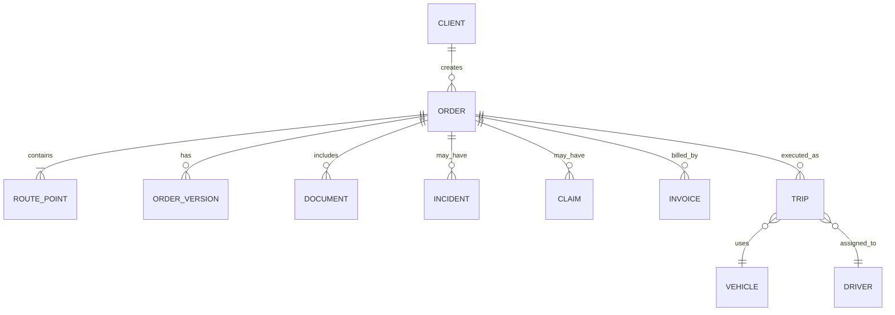

# Модель данных и интеграции

## Сущности данных

## Минимальные правила хранения

- Заказ не удаляется после регистрации: допускается только отмена с причиной.
- Изменение коммерчески значимого поля создаёт запись в истории версии.
- Документ хранит тип, дату загрузки, автора и ссылку на исходный файл.
- Инцидент и претензия не могут существовать без ссылки на заказ.
- Фактическое время доставки не редактируется без записи причины и автора изменения.

## Границы интеграции

На текущем этапе работает только статическая Wiki: ни одна из перечисленных ниже связей с заказами ещё не реализована. Для первой версии бота достаточно трёх частей:

| Компонент | Назначение | Контроль отказа |
|---|---|---|
| Telegram-бот | принимает данные заявки и показывает её статус | повторяемые запросы не создают дубли |
| Логика заказа | проверяет обязательные поля и допустимые переходы | ошибка возвращается без изменения записи |
| Постоянная база | хранит заказ и историю событий | запись подтверждается до ответа пользователю |

Внешние GPS, почтовые/SMS, бухгалтерские и файловые сервисы не входят в ближайшую реализацию. Если потребность в них подтвердится, для каждой интеграции будут отдельно заданы договор обмена, обработка сбоев и тесты. До этого ETA и события рейса могут фиксироваться сотрудником вручную.
