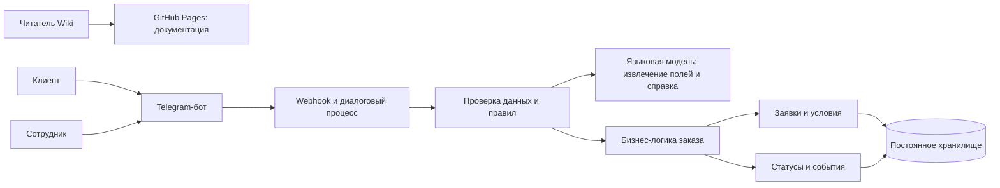

# Архитектура продукта

Решение состоит из базы знаний, канала работы с заказом и серверной логики. Компоненты имеют отдельные обязанности и обмениваются данными через определённые интерфейсы.

## Логическая схема

Wiki публикуется как статический сайт на GitHub Pages. Она содержит продуктовую и техническую документацию. Telegram-бот принимает сообщения через HTTPS webhook на Vercel Functions. Функция проверяет секрет webhook, обрабатывает обновление и использует внешние API для отправки сообщений и вызова модели. Данные заказов хранятся в отдельной постоянной базе, а не в файловой системе статического сайта или временном хранилище функции.

Языковая модель вызывается через Vercel AI Gateway; конкретный кандидат — `meta/llama-4-scout`. Она получает ограниченный контекст: текущую реплику, схему доступных полей и найденный фрагмент справки. Модель возвращает предположения в заданной структуре, а сервер проверяет их по типам и бизнес-правилам. Модель не меняет заказ, статус и тариф напрямую. Пошаговый сценарий продолжает работать без LLM, если модель недоступна или не уверена в разборе.

## Решения и границы

| Принцип | Решение | Обоснование |
|---|---|---|
| Доступность документации | отдельный статический сайт Wiki | документация не зависит от исполнения операций заказа |
| Работа с заказом | Telegram-бот обращается к общей логике через серверный webhook | ввод и валидация не смешиваются с публикацией Wiki |
| Контроль операций | переходы статусов выполняет детерминированная бизнес-логика | языковая модель не должна принимать невалидированные решения |
| Интерпретация текста | LLM предлагает значения полей и справочные ответы в ограниченной схеме | свободный ввод удобнее, а результат можно проверить перед использованием |
| История | каждое существенное изменение фиксируется отдельным событием | можно восстановить автора, время и причину изменения |
| Сохранение | используется постоянная база данных | состояние не зависит от срока жизни серверной функции |

## Основные сущности

Заказ содержит согласованные сведения о клиенте, грузе, маршруте, сроке и стоимости. Рейс отражает фактическое выполнение перевозки. Изменение статуса создаёт событие с временем, автором и причиной. Документы и уведомления связаны с заказом. Подробные связи показаны в [[../02_Справочники/06_Модель данных и интеграции|модели данных]].

## Ключевые интерфейсы

| Интерфейс | Кто использует | Какой результат ожидается |
|---|---|---|
| Страницы Wiki | преподаватель и участники проекта | доступ к требованиям, процессу и схемам |
| Диалог Telegram-бота | клиент и уполномоченный сотрудник | заявка, номер заказа, актуальный статус и изменение этапа |
| Логика и данные заказа | бот и внутренние интерфейсы | проверка данных, допустимые переходы и история событий |
| Языковая модель | серверный слой через AI Gateway | разбор свободного сообщения и поиск ответа в справке; без прямого доступа к записи заказа |
| Интерфейс документов | сотрудник и клиент | прикрепление и выдача подтверждений на дальнейшем этапе |

Почта/SMS, GPS, картографические сервисы и объектное хранилище не входят в базовую схему. Их подключение требует отдельного обоснования, договора обмена и тестирования.
