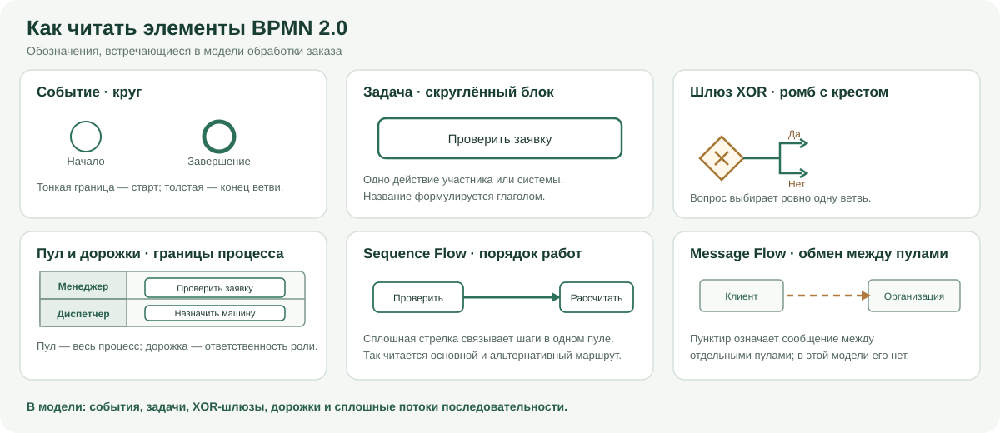

# Лабораторная работа 3 — Нотация BPMN

## Домашнее задание

Создана интеллект-карта BPMN 2.0: назначение нотации, объекты потока, дорожки, связи, шлюзы, артефакты и правила составления диаграмм.

## Лабораторная работа

Тема: «Нотация BPMN 2.0». Для варианта 8 необходимо подготовить BPMN-модель процесса обработки заказов транспортной компании, текстово описать каждый этап и отразить полученную диаграмму в Wiki продукта.

В `materials/order-process.bpmn` сохранена редактируемая модель BPMN 2.0 с BPMN DI; в `materials/order-process.svg` — её читаемая визуализация. Текст каждого этапа, решений и документов находится в `materials/Описание процесса.md`. Диаграмма также размещена на странице «Материалы курса» опубликованной Wiki.

Актуальная модель: шесть дорожек, 40 узлов, восемь XOR-шлюзов, 45 потоков последовательности и три конечных исхода. Возвраты на уточнение, пересчёт, подбор ресурсов и обработку инцидента ведут к повторяемым задачам, не проходят через блоки или конечные события. После продолжения рейса отдельный шлюз «Отклонение устранено?» возвращает процесс к согласованию решения при ответе «Нет» и к повторной проверке отклонения при ответе «Да». Претензия обрабатывается до закрытия.

Чтобы диаграмму можно было читать офлайн, добавлена визуальная легенда с формами событий, задачи, XOR-шлюза, дорожки и потоков. В ней отдельно показаны подписи «Да»/«Нет» на выходах шлюза; Message Flow пояснён как тип связи между пулами и отмечен как не используемый внутри этой модели.

Шесть SVG/PNG-фрагментов `materials/order-process-report-1.svg` … `materials/order-process-report-6.svg` используются в существующем отчёте и материалах РГР без произвольного разрезания схемы. Сборка проверяет ортогональность маршрутов, отсутствие пересечений потоков и прохождения стрелок через чужие узлы или подписи. Результат, включая достижимость графа и подписи ветвей, сохранён в `materials/validation.json`; XML проверен по официальным XSD OMG BPMN 2.0.

